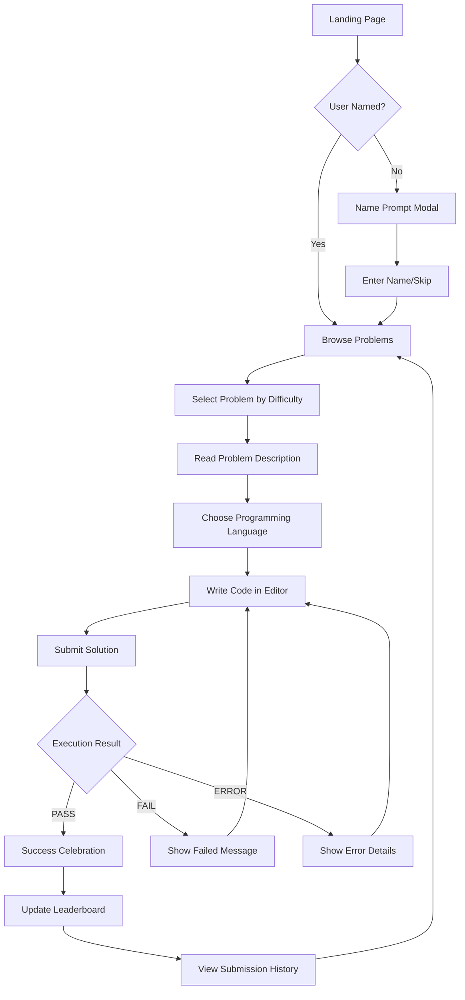
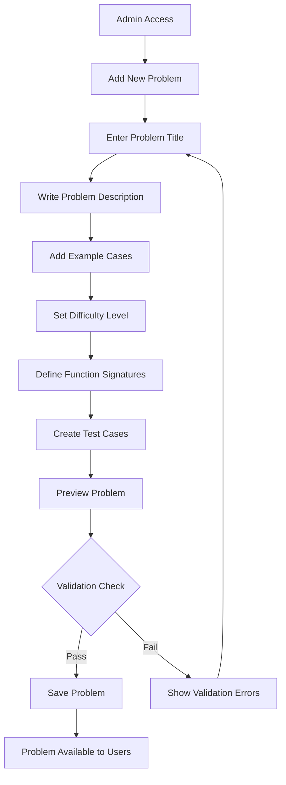

# CodeXam Platform - UI/UX Design Specifications

## Design System Overview

### Brand Identity
- **Platform Name**: CodeXam
- **Tagline**: "Code. Challenge. Conquer."
- **Mission**: Provide an accessible, engaging coding challenge platform for developers of all skill levels
- **Personality**: Professional yet approachable, clean, focused on learning and growth
- **Target Audience**: Developers, students, coding bootcamp participants, interview candidates

### Visual Design Philosophy
- **Minimalist**: Clean interfaces that don't distract from coding
- **Developer-Focused**: Familiar patterns and conventions from popular coding platforms
- **Accessible**: WCAG 2.1 AA compliant for inclusive design
- **Progressive**: Simple start with room for advanced features

## Color System

### Primary Color Palette
```css
:root {
  /* Primary Brand Colors */
  --codexam-primary: #007bff;      /* Main brand blue - buttons, links */
  --codexam-primary-dark: #0056b3;  /* Hover states, active elements */
  --codexam-primary-light: #b3d7ff; /* Light backgrounds, highlights */
  --codexam-primary-subtle: #e7f3ff; /* Very light backgrounds */
  
  /* Secondary Colors */
  --codexam-secondary: #6c757d;    /* Secondary text, icons */
  --codexam-light: #f8f9fa;       /* Light backgrounds, cards */
  --codexam-dark: #343a40;        /* Headers, important text */
  --codexam-white: #ffffff;       /* Pure white backgrounds */
  --codexam-black: #000000;       /* Pure black text */
}
```

### Status Colors (Requirement 4 - Submission Results)
```css
:root {
  /* Submission Status Colors */
  --status-pass: #28a745;         /* ✅ PASS - Green */
  --status-pass-bg: #d4edda;      /* Light green background */
  --status-pass-border: #c3e6cb;  /* Green border */
  
  --status-fail: #dc3545;         /* ❌ FAIL - Red */
  --status-fail-bg: #f8d7da;      /* Light red background */
  --status-fail-border: #f5c6cb;  /* Red border */
  
  --status-error: #fd7e14;        /* 🛑 ERROR - Orange */
  --status-error-bg: #fff3cd;     /* Light orange background */
  --status-error-border: #ffeaa7; /* Orange border */
  
  --status-timeout: #6f42c1;      /* ⏱️ TIMEOUT - Purple */
  --status-timeout-bg: #e2d9f3;   /* Light purple background */
  --status-timeout-border: #d1b3ff; /* Purple border */
}
```

### Difficulty Colors (Requirement 1 - Problem Browsing)
```css
:root {
  /* Problem Difficulty Colors */
  --difficulty-easy: #28a745;     /* Easy problems - Green */
  --difficulty-easy-bg: #d4edda;  /* Light green background */
  
  --difficulty-medium: #fd7e14;   /* Medium problems - Orange */
  --difficulty-medium-bg: #fff3cd; /* Light orange background */
  
  --difficulty-hard: #dc3545;     /* Hard problems - Red */
  --difficulty-hard-bg: #f8d7da;  /* Light red background */
}
```

## Typography System

### Font Stack
```css
:root {
  /* Primary Font - UI Text */
  --font-family-primary: 'Inter', -apple-system, BlinkMacSystemFont, 'Segoe UI', Roboto, 'Helvetica Neue', Arial, sans-serif;
  
  /* Monospace Font - Code Editor */
  --font-family-mono: 'JetBrains Mono', 'Fira Code', 'Monaco', 'Menlo', 'Ubuntu Mono', 'Consolas', 'Courier New', monospace;
  
  /* Display Font - Headers */
  --font-family-display: 'Inter', system-ui, sans-serif;
}
```

### Font Scale
```css
:root {
  /* Font Sizes */
  --text-xs: 0.75rem;     /* 12px - Small labels, captions */
  --text-sm: 0.875rem;    /* 14px - Secondary text */
  --text-base: 1rem;      /* 16px - Body text */
  --text-lg: 1.125rem;    /* 18px - Large body text */
  --text-xl: 1.25rem;     /* 20px - Small headings */
  --text-2xl: 1.5rem;     /* 24px - Medium headings */
  --text-3xl: 1.875rem;   /* 30px - Large headings */
  --text-4xl: 2.25rem;    /* 36px - Hero text */
  --text-5xl: 3rem;       /* 48px - Display text */
  
  /* Font Weights */
  --font-weight-normal: 400;
  --font-weight-medium: 500;
  --font-weight-semibold: 600;
  --font-weight-bold: 700;
  --font-weight-extrabold: 800;
  
  /* Line Heights */
  --line-height-tight: 1.25;
  --line-height-normal: 1.5;
  --line-height-relaxed: 1.75;
}
```

## Layout System

### Spacing Scale
```css
:root {
  /* Spacing Scale (based on 0.25rem = 4px) */
  --space-1: 0.25rem;    /* 4px */
  --space-2: 0.5rem;     /* 8px */
  --space-3: 0.75rem;    /* 12px */
  --space-4: 1rem;       /* 16px */
  --space-5: 1.25rem;    /* 20px */
  --space-6: 1.5rem;     /* 24px */
  --space-8: 2rem;       /* 32px */
  --space-10: 2.5rem;    /* 40px */
  --space-12: 3rem;      /* 48px */
  --space-16: 4rem;      /* 64px */
  --space-20: 5rem;      /* 80px */
  --space-24: 6rem;      /* 96px */
}
```

### Container Sizes
```css
:root {
  /* Container Widths */
  --container-sm: 640px;   /* Small screens */
  --container-md: 768px;   /* Medium screens */
  --container-lg: 1024px;  /* Large screens */
  --container-xl: 1280px;  /* Extra large screens */
  --container-2xl: 1536px; /* 2X large screens */
}
```

## Component Library

### Navigation Components (Requirements 1, 5, 8)

#### Main Navigation Header
```html
<nav class="codexam-navbar" role="navigation" aria-label="Main navigation">
  <div class="navbar-container">
    <!-- Brand/Logo -->
    <div class="navbar-brand">
      <a href="/" class="brand-link" aria-label="CodeXam Home">
        
        <span class="brand-text">CodeXam</span>
      </a>
    </div>
    
    <!-- Mobile Menu Toggle -->
    <button class="navbar-toggle" aria-label="Toggle navigation menu" aria-expanded="false">
      <span class="hamburger-line"></span>
      <span class="hamburger-line"></span>
      <span class="hamburger-line"></span>
    </button>
    
    <!-- Navigation Links -->
    <div class="navbar-nav">
      <a href="/problems" class="nav-link" aria-current="page">
        <i class="icon-code" aria-hidden="true"></i>
        Problems
      </a>
      <a href="/submissions" class="nav-link">
        <i class="icon-history" aria-hidden="true"></i>
        My Submissions
      </a>
      <a href="/leaderboard" class="nav-link">
        <i class="icon-trophy" aria-hidden="true"></i>
        Leaderboard
      </a>
    </div>
    
    <!-- User Section -->
    <div class="navbar-user">
      <span class="user-name" id="current-user">Anonymous</span>
      <button class="btn btn-outline-light btn-sm" id="change-name">
        Change Name
      </button>
    </div>
  </div>
</nav>
```

**CSS Specifications:**
```css
.codexam-navbar {
  background: var(--codexam-primary);
  color: white;
  padding: var(--space-4) 0;
  box-shadow: 0 2px 4px rgba(0,0,0,0.1);
  position: sticky;
  top: 0;
  z-index: 1000;
}

.navbar-container {
  max-width: var(--container-xl);
  margin: 0 auto;
  padding: 0 var(--space-4);
  display: flex;
  align-items: center;
  justify-content: space-between;
}

.brand-link {
  display: flex;
  align-items: center;
  text-decoration: none;
  color: white;
  font-weight: var(--font-weight-bold);
  font-size: var(--text-xl);
}

.brand-logo {
  height: 32px;
  margin-right: var(--space-2);
}

.nav-link {
  color: rgba(255,255,255,0.9);
  text-decoration: none;
  padding: var(--space-2) var(--space-4);
  border-radius: 0.375rem;
  transition: all 0.15s ease;
  display: flex;
  align-items: center;
  gap: var(--space-2);
}

.nav-link:hover,
.nav-link[aria-current="page"] {
  background: rgba(255,255,255,0.1);
  color: white;
}
```

### Problem Display Components (Requirements 1, 2)

#### Problem Card (Requirement 1 - Problem Browsing)
```html
<div class="problem-card" role="article" aria-labelledby="problem-title-1">
  <div class="problem-header">
    <h3 class="problem-title" id="problem-title-1">
      <a href="/problem/1" class="problem-link">Two Sum</a>
    </h3>
    <span class="difficulty-badge difficulty-easy" aria-label="Difficulty: Easy">
      Easy
    </span>
  </div>
  
  <p class="problem-description">
    Given an array of integers, return indices of two numbers that add up to a specific target.
  </p>
  
  <div class="problem-stats">
    <div class="stat-item">
      <i class="icon-users" aria-hidden="true"></i>
      <span class="stat-value">1,234</span>
      <span class="stat-label">solved</span>
    </div>
    <div class="stat-item">
      <i class="icon-clock" aria-hidden="true"></i>
      <span class="stat-value">15 min</span>
      <span class="stat-label">avg time</span>
    </div>
    <div class="stat-item">
      <i class="icon-check-circle" aria-hidden="true"></i>
      <span class="stat-value">85%</span>
      <span class="stat-label">success rate</span>
    </div>
  </div>
  
  <div class="problem-actions">
    <a href="/problem/1" class="btn btn-primary btn-sm">
      Solve Problem
    </a>
  </div>
</div>
```

**CSS Specifications:**
```css
.problem-card {
  background: var(--codexam-white);
  border: 1px solid #e9ecef;
  border-radius: 0.5rem;
  padding: var(--space-6);
  transition: all 0.15s ease;
  height: 100%;
  display: flex;
  flex-direction: column;
}

.problem-card:hover {
  box-shadow: 0 4px 12px rgba(0,0,0,0.1);
  transform: translateY(-2px);
  border-color: var(--codexam-primary-light);
}

.problem-header {
  display: flex;
  justify-content: space-between;
  align-items: flex-start;
  margin-bottom: var(--space-4);
}

.problem-title {
  margin: 0;
  font-size: var(--text-lg);
  font-weight: var(--font-weight-semibold);
  line-height: var(--line-height-tight);
}

.problem-link {
  color: var(--codexam-dark);
  text-decoration: none;
}

.problem-link:hover {
  color: var(--codexam-primary);
}

.difficulty-badge {
  padding: var(--space-1) var(--space-3);
  border-radius: 9999px;
  font-size: var(--text-xs);
  font-weight: var(--font-weight-medium);
  text-transform: uppercase;
  letter-spacing: 0.05em;
}

.difficulty-easy {
  background: var(--difficulty-easy-bg);
  color: var(--difficulty-easy);
}

.difficulty-medium {
  background: var(--difficulty-medium-bg);
  color: var(--difficulty-medium);
}

.difficulty-hard {
  background: var(--difficulty-hard-bg);
  color: var(--difficulty-hard);
}
```

#### Problem Detail View (Requirement 2 - Problem Details)
```html
<div class="problem-detail-container">
  <div class="problem-detail-header">
    <nav aria-label="breadcrumb" class="breadcrumb-nav">
      <ol class="breadcrumb">
        <li class="breadcrumb-item"><a href="/">Home</a></li>
        <li class="breadcrumb-item"><a href="/problems">Problems</a></li>
        <li class="breadcrumb-item active" aria-current="page">Two Sum</li>
      </ol>
    </nav>
    
    <div class="problem-meta">
      <h1 class="problem-title">Two Sum</h1>
      <div class="problem-badges">
        <span class="difficulty-badge difficulty-easy">Easy</span>
        <span class="problem-id">#1</span>
      </div>
    </div>
  </div>
  
  <div class="problem-content">
    <section class="problem-description" aria-labelledby="description-heading">
      <h2 id="description-heading">Problem Description</h2>
      <div class="description-content">
        <p>Given an array of integers <code>nums</code> and an integer <code>target</code>, return indices of the two numbers such that they add up to <code>target</code>.</p>
        <p>You may assume that each input would have exactly one solution, and you may not use the same element twice.</p>
        <p>You can return the answer in any order.</p>
      </div>
    </section>
    
    <section class="problem-examples" aria-labelledby="examples-heading">
      <h2 id="examples-heading">Examples</h2>
      
      <div class="example-block">
        <h3>Example 1:</h3>
        <div class="example-content">
          <div class="example-input">
            <strong>Input:</strong>
            <pre><code>nums = [2,7,11,15], target = 9</code></pre>
          </div>
          <div class="example-output">
            <strong>Output:</strong>
            <pre><code>[0,1]</code></pre>
          </div>
          <div class="example-explanation">
            <strong>Explanation:</strong> Because nums[0] + nums[1] == 9, we return [0, 1].
          </div>
        </div>
      </div>
    </section>
    
    <section class="problem-constraints" aria-labelledby="constraints-heading">
      <h2 id="constraints-heading">Constraints</h2>
      <ul class="constraints-list">
        <li><code>2 ≤ nums.length ≤ 10⁴</code></li>
        <li><code>-10⁹ ≤ nums[i] ≤ 10⁹</code></li>
        <li><code>-10⁹ ≤ target ≤ 10⁹</code></li>
        <li>Only one valid answer exists.</li>
      </ul>
    </section>
  </div>
</div>
```

### Code Editor Components (Requirement 3 - Multi-language Editor)

#### Language Selector
```html
<div class="language-selector-container">
  <label for="language-select" class="language-label">
    <i class="icon-code" aria-hidden="true"></i>
    Language:
  </label>
  <select id="language-select" class="language-select" aria-describedby="language-help">
    <option value="python" data-template="def solution(nums, target):&#10;    pass">Python</option>
    <option value="javascript" data-template="function solution(nums, target) {&#10;    // Your code here&#10;}">JavaScript</option>
    <option value="java" data-template="public int[] solution(int[] nums, int target) {&#10;    // Your code here&#10;}">Java</option>
    <option value="cpp" data-template="vector&lt;int&gt; solution(vector&lt;int&gt;&amp; nums, int target) {&#10;    // Your code here&#10;}">C++</option>
  </select>
  <div id="language-help" class="language-help">
    Select your preferred programming language
  </div>
</div>
```

#### Code Editor Interface
```html
<div class="code-editor-container" role="region" aria-label="Code editor">
  <div class="editor-header">
    <div class="editor-title">
      <h3>Solution</h3>
    </div>
    <div class="editor-actions">
      <button class="btn btn-outline-secondary btn-sm" id="reset-code" 
              aria-describedby="reset-help">
        <i class="icon-refresh" aria-hidden="true"></i>
        Reset
      </button>
      <div id="reset-help" class="sr-only">Reset code to original template</div>
      
      <button class="btn btn-outline-secondary btn-sm" id="run-code"
              aria-describedby="run-help">
        <i class="icon-play" aria-hidden="true"></i>
        Run
      </button>
      <div id="run-help" class="sr-only">Test your code with sample inputs</div>
    </div>
  </div>
  
  <div class="editor-wrapper">
    <div class="editor-line-numbers" aria-hidden="true"></div>
    <textarea id="code-editor" 
              class="code-input" 
              aria-label="Code editor"
              spellcheck="false"
              autocomplete="off"
              autocorrect="off"
              autocapitalize="off">
def solution(nums, target):
    pass
    </textarea>
  </div>
  
  <div class="editor-footer">
    <div class="editor-info">
      <span class="editor-language" id="current-language">Python</span>
      <span class="editor-separator">•</span>
      <span class="editor-lines" id="line-count">2 lines</span>
    </div>
    <button class="btn btn-primary btn-lg" id="submit-code"
            aria-describedby="submit-help">
      <i class="icon-send" aria-hidden="true"></i>
      Submit Solution
    </button>
    <div id="submit-help" class="sr-only">Submit your code for evaluation</div>
  </div>
</div>
```

**CSS Specifications:**
```css
.code-editor-container {
  background: var(--codexam-white);
  border: 1px solid #e9ecef;
  border-radius: 0.5rem;
  overflow: hidden;
}

.editor-header {
  background: #f8f9fa;
  padding: var(--space-4);
  border-bottom: 1px solid #e9ecef;
  display: flex;
  justify-content: space-between;
  align-items: center;
}

.editor-wrapper {
  position: relative;
  display: flex;
}

.editor-line-numbers {
  background: #f8f9fa;
  padding: var(--space-4) var(--space-2);
  font-family: var(--font-family-mono);
  font-size: var(--text-sm);
  color: var(--codexam-secondary);
  user-select: none;
  min-width: 3rem;
  text-align: right;
}

.code-input {
  flex: 1;
  border: none;
  outline: none;
  padding: var(--space-4);
  font-family: var(--font-family-mono);
  font-size: var(--text-sm);
  line-height: 1.5;
  resize: vertical;
  min-height: 300px;
  background: var(--codexam-white);
}

.editor-footer {
  background: #f8f9fa;
  padding: var(--space-4);
  border-top: 1px solid #e9ecef;
  display: flex;
  justify-content: space-between;
  align-items: center;
}
```

### Result Display Components (Requirement 4 - Submission Feedback)

#### Submission Result Display
```html
<div class="submission-result" role="alert" aria-live="polite">
  <div class="result-pass" id="result-container">
    <div class="result-header">
      <div class="result-status">
        <i class="icon-check-circle result-icon" aria-hidden="true"></i>
        <span class="status-text">PASS</span>
      </div>
      <div class="result-timestamp">
        Submitted <time datetime="2024-01-15T10:30:00Z">2 minutes ago</time>
      </div>
    </div>
    
    <div class="result-details">
      <div class="result-stats">
        <div class="stat-item">
          <span class="stat-label">Runtime:</span>
          <span class="stat-value">45ms</span>
        </div>
        <div class="stat-item">
          <span class="stat-label">Memory:</span>
          <span class="stat-value">14.2MB</span>
        </div>
        <div class="stat-item">
          <span class="stat-label">Test Cases:</span>
          <span class="stat-value">15/15 passed</span>
        </div>
      </div>
      
      <div class="result-message">
        <p>Congratulations! Your solution passed all test cases.</p>
      </div>
    </div>
  </div>
</div>
```

**Result Variants:**
```css
/* PASS Result */
.result-pass {
  background: var(--status-pass-bg);
  border: 1px solid var(--status-pass-border);
  color: var(--status-pass);
}

.result-pass .result-icon {
  color: var(--status-pass);
}

/* FAIL Result */
.result-fail {
  background: var(--status-fail-bg);
  border: 1px solid var(--status-fail-border);
  color: var(--status-fail);
}

.result-fail .result-icon {
  color: var(--status-fail);
}

/* ERROR Result */
.result-error {
  background: var(--status-error-bg);
  border: 1px solid var(--status-error-border);
  color: var(--status-error);
}

.result-error .result-icon {
  color: var(--status-error);
}
```

### Data Display Components

#### Submission History Table (Requirement 5 - Submission History)
```html
<div class="submissions-container" role="region" aria-labelledby="submissions-heading">
  <div class="submissions-header">
    <h2 id="submissions-heading">My Submissions</h2>
    <div class="submissions-filters">
      <select class="form-select form-select-sm" aria-label="Filter by problem">
        <option value="">All Problems</option>
        <option value="1">Two Sum</option>
        <option value="2">Add Two Numbers</option>
      </select>
      <select class="form-select form-select-sm" aria-label="Filter by status">
        <option value="">All Status</option>
        <option value="PASS">PASS</option>
        <option value="FAIL">FAIL</option>
        <option value="ERROR">ERROR</option>
      </select>
    </div>
  </div>
  
  <div class="submissions-table-container">
    <table class="submissions-table" role="table">
      <thead>
        <tr>
          <th scope="col">Problem</th>
          <th scope="col">Language</th>
          <th scope="col">Status</th>
          <th scope="col">Runtime</th>
          <th scope="col">Submitted</th>
          <th scope="col">Actions</th>
        </tr>
      </thead>
      <tbody>
        <tr class="submission-row">
          <td class="problem-cell">
            <a href="/problem/1" class="problem-link">Two Sum</a>
          </td>
          <td class="language-cell">
            <span class="language-badge language-python">Python</span>
          </td>
          <td class="status-cell">
            <span class="status-badge status-pass" aria-label="Status: Passed">
              <i class="icon-check-circle" aria-hidden="true"></i>
              PASS
            </span>
          </td>
          <td class="runtime-cell">45ms</td>
          <td class="time-cell">
            <time datetime="2024-01-15T08:30:00Z">2 hours ago</time>
          </td>
          <td class="actions-cell">
            <button class="btn btn-sm btn-outline-primary" 
                    aria-label="View submission code">
              View Code
            </button>
          </td>
        </tr>
      </tbody>
    </table>
  </div>
  
  <!-- Empty State -->
  <div class="empty-state" style="display: none;">
    <div class="empty-state-icon">
      <i class="icon-code-slash" aria-hidden="true"></i>
    </div>
    <h3 class="empty-state-title">No submissions yet</h3>
    <p class="empty-state-description">
      Start solving problems to see your submission history here.
    </p>
    <a href="/problems" class="btn btn-primary">Browse Problems</a>
  </div>
</div>
```

#### Leaderboard Display (Requirement 8 - User Rankings)
```html
<div class="leaderboard-container" role="region" aria-labelledby="leaderboard-heading">
  <div class="leaderboard-header">
    <h2 id="leaderboard-heading">
      <i class="icon-trophy" aria-hidden="true"></i>
      Leaderboard
    </h2>
    <div class="leaderboard-filters">
      <select class="form-select form-select-sm" aria-label="Time period filter">
        <option value="all">All Time</option>
        <option value="month">This Month</option>
        <option value="week">This Week</option>
      </select>
    </div>
  </div>
  
  <div class="leaderboard-podium">
    <!-- Top 3 Users -->
    <div class="podium-item podium-second">
      <div class="podium-rank">2</div>
      <div class="podium-user">
        <div class="user-avatar">B</div>
        <div class="user-name">Bob Smith</div>
        <div class="user-score">38 problems</div>
      </div>
    </div>
    
    <div class="podium-item podium-first">
      <div class="podium-rank">1</div>
      <div class="podium-user">
        <div class="user-avatar">A</div>
        <div class="user-name">Alice Johnson</div>
        <div class="user-score">42 problems</div>
      </div>
      <div class="podium-crown">
        <i class="icon-crown" aria-hidden="true"></i>
      </div>
    </div>
    
    <div class="podium-item podium-third">
      <div class="podium-rank">3</div>
      <div class="podium-user">
        <div class="user-avatar">C</div>
        <div class="user-name">Charlie Brown</div>
        <div class="user-score">35 problems</div>
      </div>
    </div>
  </div>
  
  <div class="leaderboard-list">
    <div class="leaderboard-item" data-rank="4">
      <div class="rank-badge">4</div>
      <div class="user-info">
        <div class="user-avatar">D</div>
        <div class="user-details">
          <span class="user-name">Diana Prince</span>
          <span class="user-stats">32 problems solved</span>
        </div>
      </div>
      <div class="user-score">2,560 pts</div>
    </div>
  </div>
</div>
```

### User Identification Components (Requirement 7)

#### Name Prompt Modal
```html
<div class="modal fade" id="nameModal" tabindex="-1" aria-labelledby="nameModalLabel" aria-hidden="true">
  <div class="modal-dialog modal-dialog-centered">
    <div class="modal-content">
      <div class="modal-header">
        <h5 class="modal-title" id="nameModalLabel">
          <i class="icon-user" aria-hidden="true"></i>
          Welcome to CodeXam!
        </h5>
      </div>
      <div class="modal-body">
        <p>Enter your name to track your progress and appear on the leaderboard.</p>
        <form id="nameForm">
          <div class="mb-3">
            <label for="userName" class="form-label">Your Name</label>
            <input type="text" 
                   class="form-control" 
                   id="userName" 
                   placeholder="Enter your name"
                   maxlength="50"
                   required
                   aria-describedby="nameHelp">
            <div id="nameHelp" class="form-text">
              This will be displayed on the leaderboard and with your submissions.
            </div>
          </div>
          <div class="form-check">
            <input class="form-check-input" type="checkbox" id="rememberName" checked>
            <label class="form-check-label" for="rememberName">
              Remember my name for future visits
            </label>
          </div>
        </form>
      </div>
      <div class="modal-footer">
        <button type="button" class="btn btn-secondary" id="skipName">
          Skip (Stay Anonymous)
        </button>
        <button type="submit" class="btn btn-primary" form="nameForm">
          Save Name
        </button>
      </div>
    </div>
  </div>
</div>
```

## User Experience Flow Diagrams

### Primary User Journey: Problem Solving


### Admin Problem Creation Flow


## Responsive Design Requirements

### Breakpoint System
```css
/* Mobile First Responsive Design */
:root {
  /* Breakpoints */
  --breakpoint-sm: 576px;   /* Small devices (landscape phones) */
  --breakpoint-md: 768px;   /* Medium devices (tablets) */
  --breakpoint-lg: 992px;   /* Large devices (desktops) */
  --breakpoint-xl: 1200px;  /* Extra large devices */
  --breakpoint-2xl: 1400px; /* Extra extra large devices */
}

/* Media Queries */
@media (max-width: 575.98px) {
  /* Extra small devices (portrait phones) */
  .container { padding: 0 var(--space-4); }
  .problem-card { margin-bottom: var(--space-4); }
  .code-editor-container { border-radius: 0; }
}

@media (min-width: 576px) and (max-width: 767.98px) {
  /* Small devices (landscape phones) */
  .problems-grid { grid-template-columns: 1fr; }
}

@media (min-width: 768px) and (max-width: 991.98px) {
  /* Medium devices (tablets) */
  .problems-grid { grid-template-columns: repeat(2, 1fr); }
  .problem-detail-layout { grid-template-columns: 1fr 1fr; }
}

@media (min-width: 992px) {
  /* Large devices (desktops) */
  .problems-grid { grid-template-columns: repeat(3, 1fr); }
  .problem-detail-layout { grid-template-columns: 1fr 1.5fr; }
}
```

### Mobile Adaptations

#### Navigation (Mobile)
```css
@media (max-width: 767.98px) {
  .navbar-nav {
    position: fixed;
    top: 100%;
    left: 0;
    right: 0;
    background: var(--codexam-primary);
    flex-direction: column;
    padding: var(--space-4);
    transform: translateY(-100%);
    transition: transform 0.3s ease;
    z-index: 999;
  }
  
  .navbar-nav.active {
    transform: translateY(0);
  }
  
  .navbar-toggle {
    display: block;
    background: none;
    border: none;
    color: white;
    padding: var(--space-2);
  }
  
  .nav-link {
    padding: var(--space-3) 0;
    border-bottom: 1px solid rgba(255,255,255,0.1);
  }
}
```

#### Code Editor (Mobile)
```css
@media (max-width: 767.98px) {
  .code-editor-container {
    margin: 0 calc(-1 * var(--space-4));
    border-radius: 0;
    border-left: none;
    border-right: none;
  }
  
  .editor-wrapper {
    flex-direction: column;
  }
  
  .editor-line-numbers {
    display: none; /* Hide line numbers on mobile */
  }
  
  .code-input {
    font-size: 16px; /* Prevent zoom on iOS */
    min-height: 250px;
  }
  
  .editor-footer {
    flex-direction: column;
    gap: var(--space-3);
  }
  
  .btn-lg {
    width: 100%;
    padding: var(--space-4);
  }
}
```

## Accessibility Standards (WCAG 2.1 AA)

### Color and Contrast
```css
/* Ensure minimum contrast ratios */
:root {
  /* Text on white background - 4.5:1 minimum */
  --text-primary: #212529;     /* 16.75:1 ratio */
  --text-secondary: #6c757d;   /* 4.54:1 ratio */
  
  /* Text on colored backgrounds */
  --text-on-primary: #ffffff;  /* 4.59:1 on primary blue */
  --text-on-success: #ffffff;  /* 4.52:1 on success green */
  --text-on-danger: #ffffff;   /* 5.47:1 on danger red */
}

/* High contrast mode support */
@media (prefers-contrast: high) {
  :root {
    --codexam-primary: #0056b3;
    --text-secondary: #495057;
  }
  
  .problem-card {
    border-width: 2px;
  }
  
  .btn {
    border-width: 2px;
  }
}
```

### Focus Management
```css
/* Visible focus indicators */
:focus {
  outline: 2px solid var(--codexam-primary);
  outline-offset: 2px;
}

/* Skip links for keyboard navigation */
.skip-link {
  position: absolute;
  top: -40px;
  left: 6px;
  background: var(--codexam-primary);
  color: white;
  padding: 8px;
  text-decoration: none;
  border-radius: 0 0 4px 4px;
  z-index: 1000;
}

.skip-link:focus {
  top: 0;
}

/* Focus within containers */
.code-editor-container:focus-within {
  box-shadow: 0 0 0 2px var(--codexam-primary);
}
```

### Screen Reader Support
```css
/* Screen reader only content */
.sr-only {
  position: absolute;
  width: 1px;
  height: 1px;
  padding: 0;
  margin: -1px;
  overflow: hidden;
  clip: rect(0, 0, 0, 0);
  white-space: nowrap;
  border: 0;
}

/* Show on focus for keyboard users */
.sr-only:focus {
  position: static;
  width: auto;
  height: auto;
  padding: inherit;
  margin: inherit;
  overflow: visible;
  clip: auto;
  white-space: normal;
}
```

### Motion and Animation
```css
/* Respect reduced motion preferences */
@media (prefers-reduced-motion: reduce) {
  *,
  *::before,
  *::after {
    animation-duration: 0.01ms !important;
    animation-iteration-count: 1 !important;
    transition-duration: 0.01ms !important;
    scroll-behavior: auto !important;
  }
  
  .problem-card:hover {
    transform: none;
  }
  
  .navbar-nav {
    transition: none;
  }
}

/* Smooth scrolling for users who prefer motion */
@media (prefers-reduced-motion: no-preference) {
  html {
    scroll-behavior: smooth;
  }
}
```

## Performance Optimization

### CSS Optimization
```css
/* Use CSS containment for better performance */
.problem-card {
  contain: layout style paint;
}

.code-editor-container {
  contain: layout;
}

/* Optimize animations */
.problem-card {
  will-change: transform, box-shadow;
}

.problem-card:not(:hover) {
  will-change: auto;
}

/* Use transform for better performance */
.btn:active {
  transform: translateY(1px);
}
```

### Loading States
```css
/* Skeleton loading for problem cards */
.problem-card-skeleton {
  background: linear-gradient(90deg, #f0f0f0 25%, #e0e0e0 50%, #f0f0f0 75%);
  background-size: 200% 100%;
  animation: loading 1.5s infinite;
}

@keyframes loading {
  0% { background-position: 200% 0; }
  100% { background-position: -200% 0; }
}

/* Loading spinner */
.spinner {
  width: 20px;
  height: 20px;
  border: 2px solid #f3f3f3;
  border-top: 2px solid var(--codexam-primary);
  border-radius: 50%;
  animation: spin 1s linear infinite;
}

@keyframes spin {
  0% { transform: rotate(0deg); }
  100% { transform: rotate(360deg); }
}
```

This comprehensive UI/UX specification ensures that the CodeXam platform provides an excellent user experience while meeting all accessibility standards and supporting all the requirements defined in your specification.